# EduTech
<br>
<p align="center">
  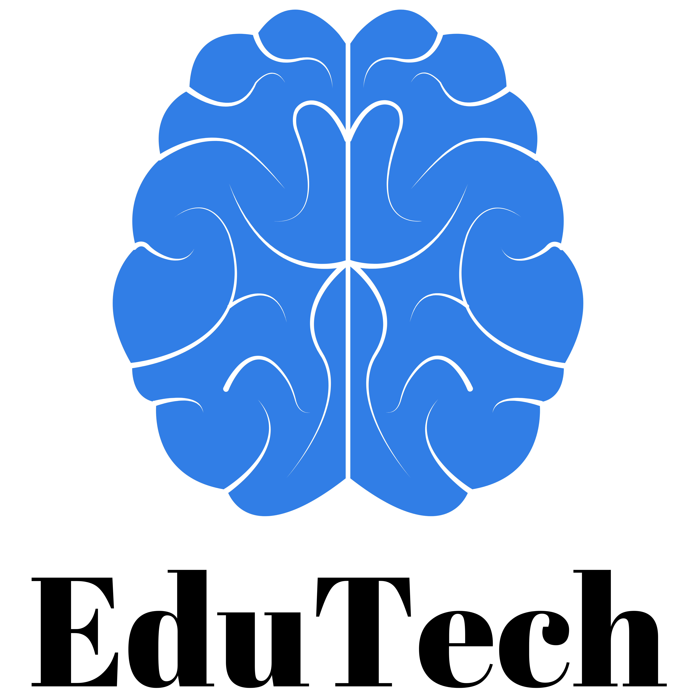
  <br><br>
</p>

## 🌟 Project Overview

This project is a **C++ console-based Electronic School Quiz System**.  
The application allows students to test their knowledge in different school subjects through simple interactive quizzes.

The program currently includes quizzes in:

- Mathematics
- Chemistry
- English

Each test contains **6 randomly selected questions** from a question bank.  
Questions are shuffled so they **do not repeat during the test**.

Each correct answer gives **1 point**, with a maximum score of **6 points**.

---

## 🎮 How It Works

1. The program starts with a simple menu.
2. The user chooses **Start Test**.
3. The player selects a subject:
   - Math
   - Chemistry
   - English
4. The program asks **6 random questions**.
5. The final score is displayed at the end of the quiz.


## 🛠️ Technologies Used  

### 💻 Programming Language  
<p align="left">
  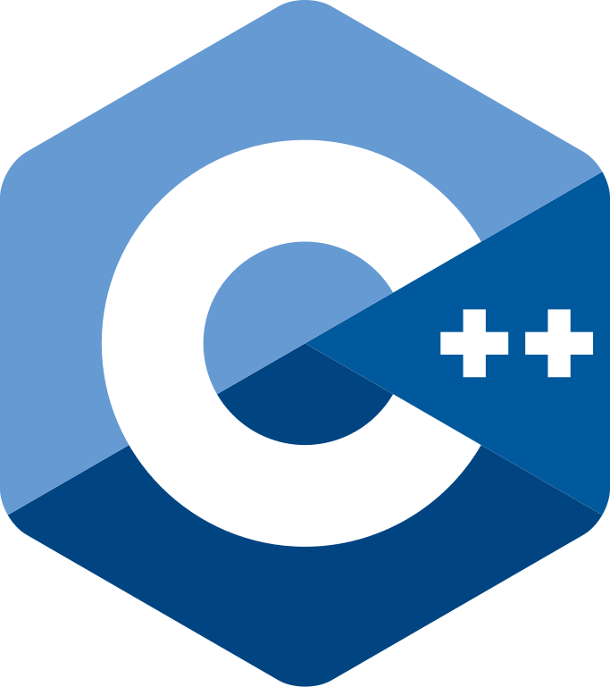
</p>

### 📝 Code Editors  
<p align="left">
  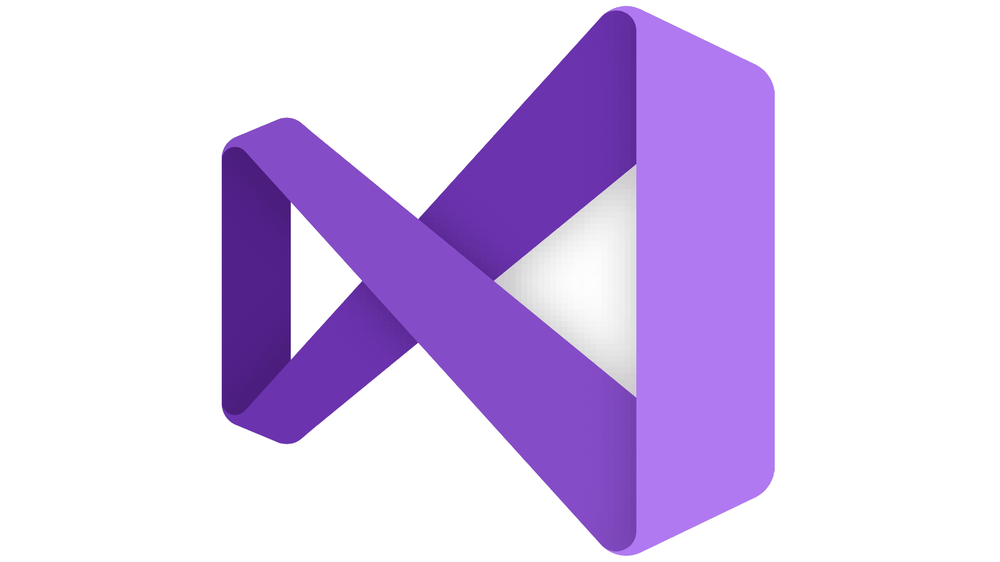
  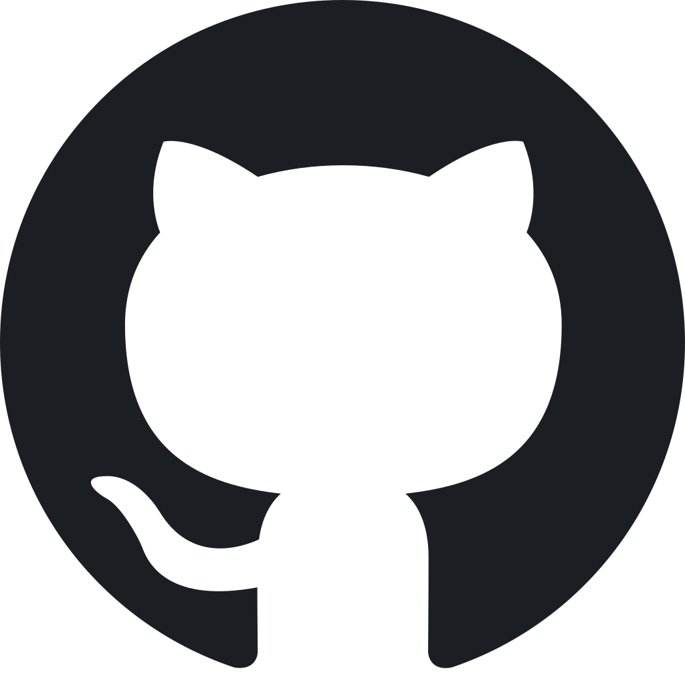
</p>

### 🎨 Design
<p align="left">
  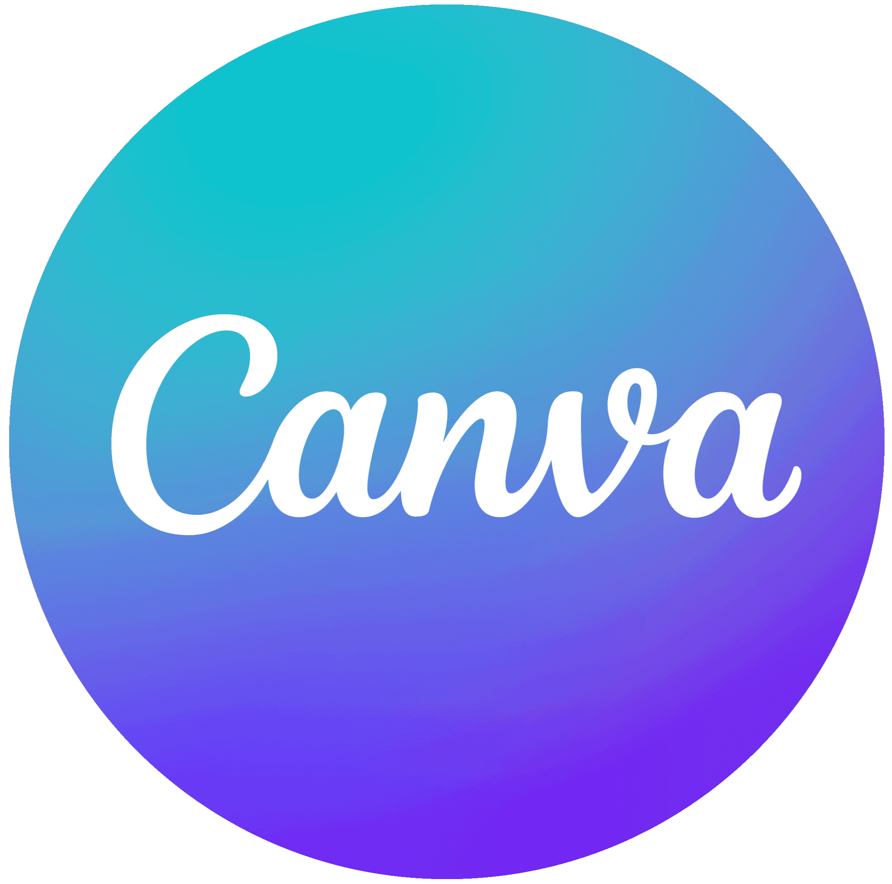
  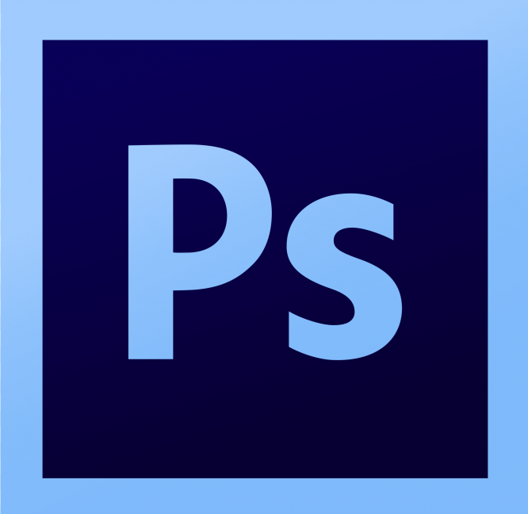
</p>

### 📑 Documentation & Presentation  
<p align="left">
  
  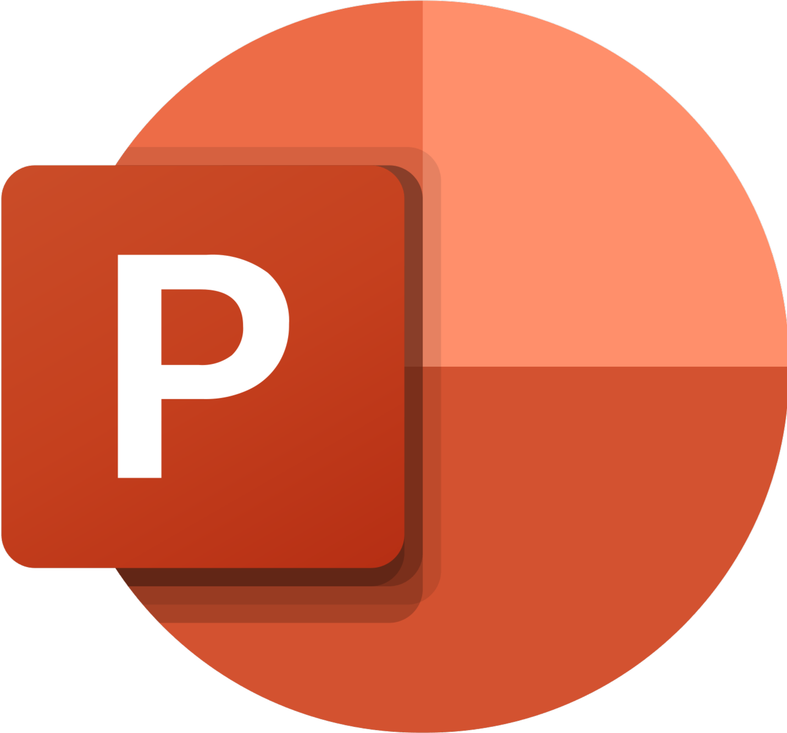
</p>

### 💬 Communication
<p align="left">
  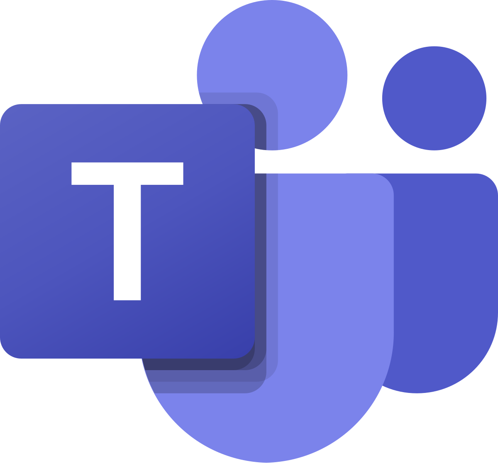
</p>

## 📂 Documentation & Presentation  
### 📋 Documentation  
[Documentation](comming soon (#))
### 🎤 Presentation  
[Presentation](comming soon(#))

## 👨🏻‍💻 Team Members  

| Photo | Name | Class | Role |
|------|------|-------|------|
| | [Teodor Spasov Todorov](https://github.com/TSTodorov24) | 9A | Scrum Trainer |
|  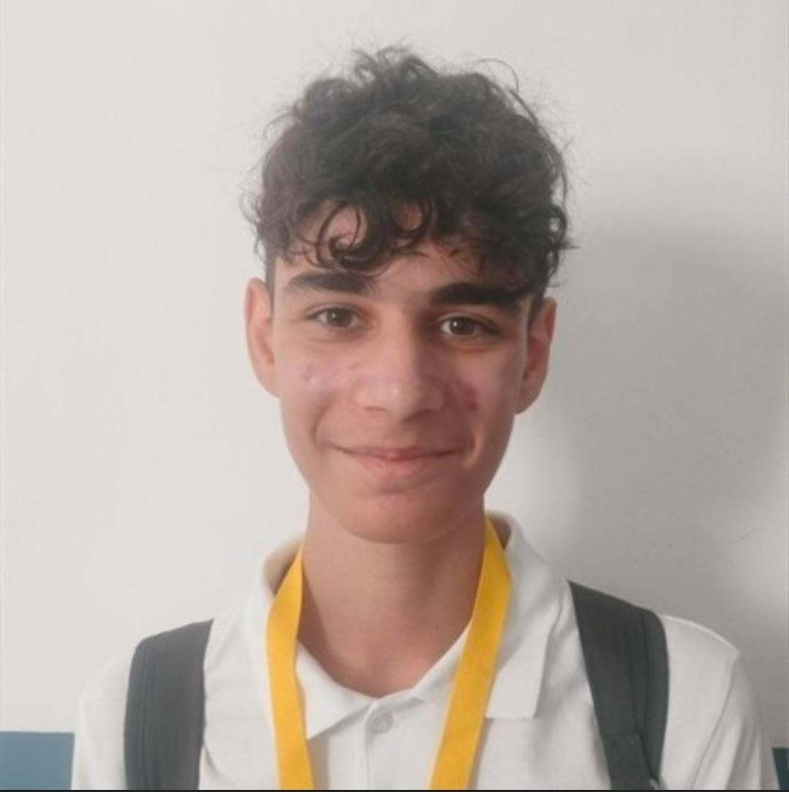| [Radostin Veselinov Dimkirichev](https://github.com/RVDimkirichev24) | 9B | Backеnd Developer |
| 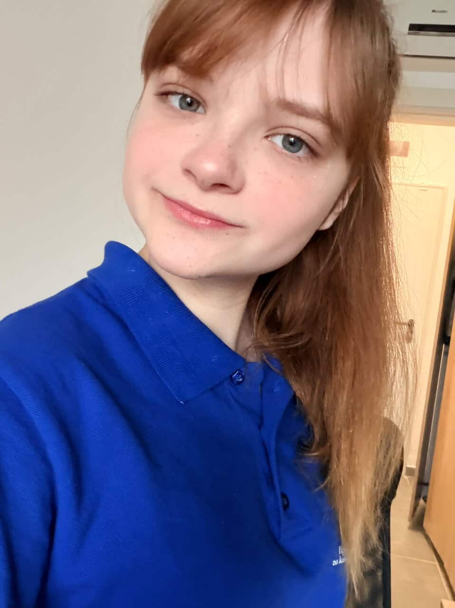| [Oleksandra Oleksandrivna Kikavska ](https://github.com/OOKikavsyka24) | 9V | Quality engineer |
|  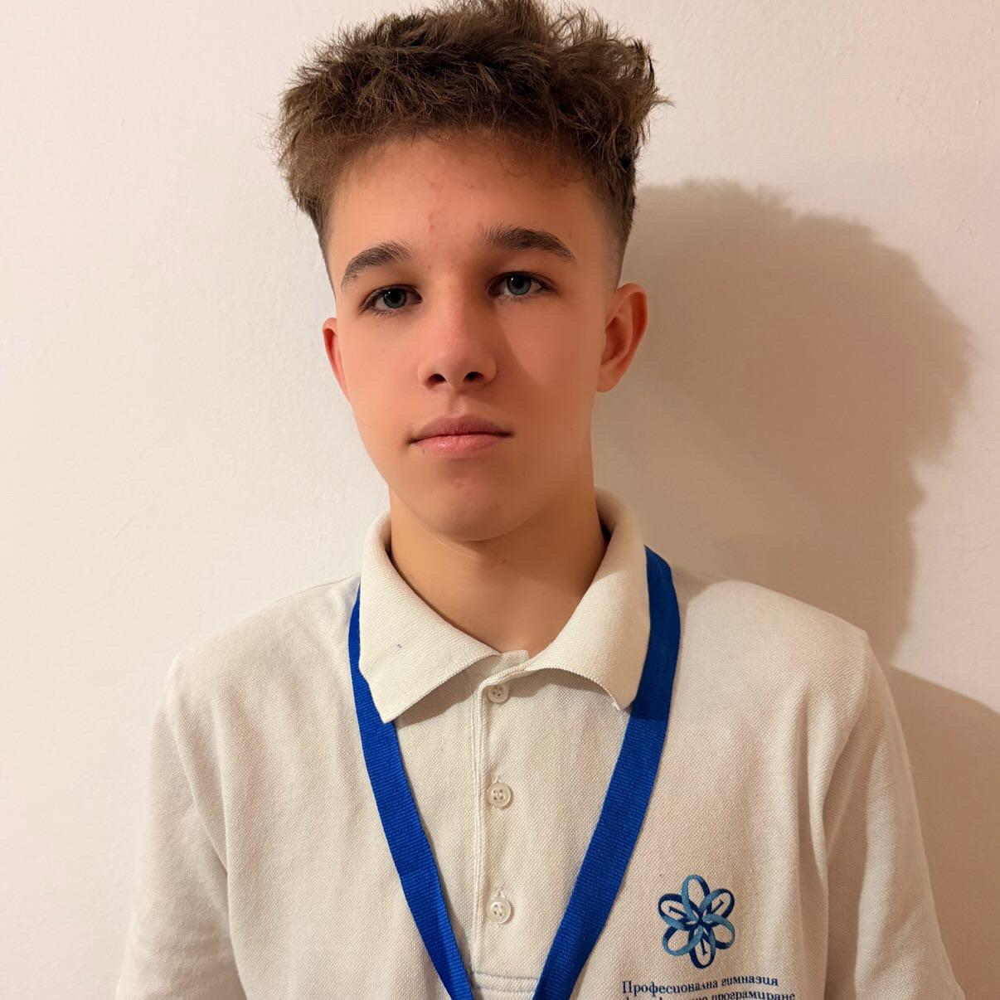| [Alexander Antonov Kasabov](https://github.com/AAKasabov24) | 9G | BackEnd Developer |

## 📈 Project Milestones

- **Phase 1**: Planning the project idea and structure  
- **Phase 2**: Creating the question system and data structures  
- **Phase 3**: Implementing the quiz logic in C++  
- **Phase 4**: Adding subjects (Math, Chemistry, English) and random questions  
- **Phase 5**: Testing the program and fixing bugs  
- **Phase 6**: Preparing documentation, presentation and GitHub repository

---

## 🔧 Clone the repository to your local PC:

```
git clone https://github.com/TSTodorov24/EduTech

```

---
<p align="center">
  Developed by Team EduTech <br>
  2026
</p>
